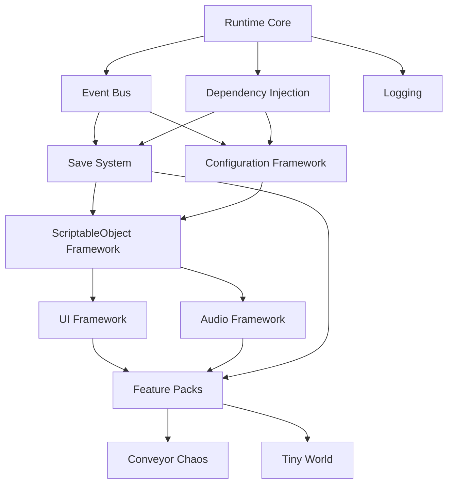

# Game OS Dependency Graph

## 1. Overview
This document defines the strict hierarchical dependencies of the Wonder Forge Game OS. Cyclic dependencies are prohibited.

## 2. Mermaid Visualization (Layer 4)

## 3. Enforcement
- The `Testing_Framework` validates this graph by analyzing assembly definition files (`.asmdef`) in Unity. If a Feature Pack references a Game assembly, the CI/CD build fails.
